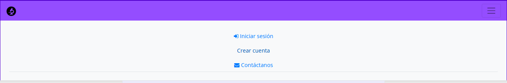
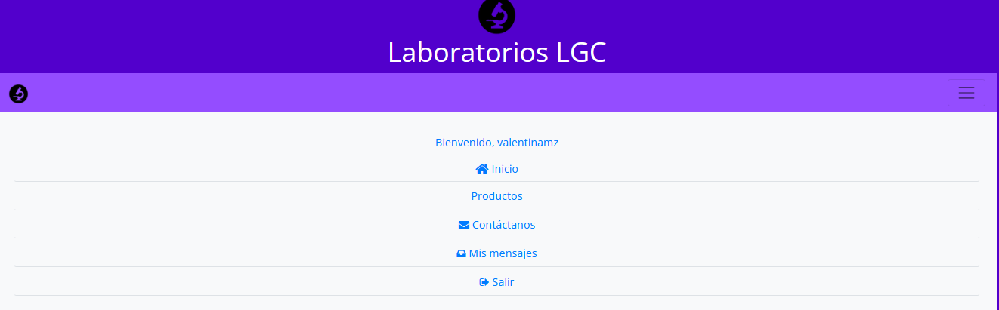
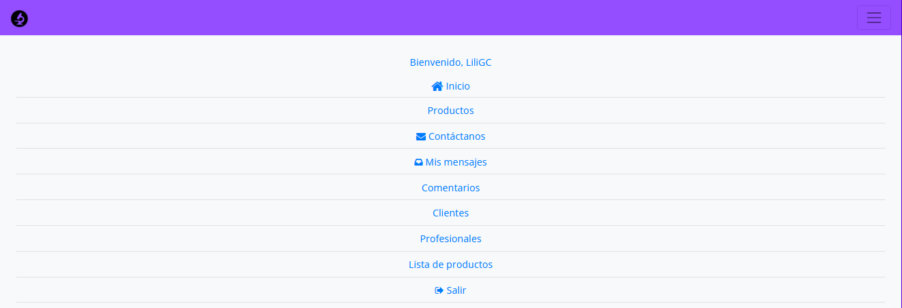
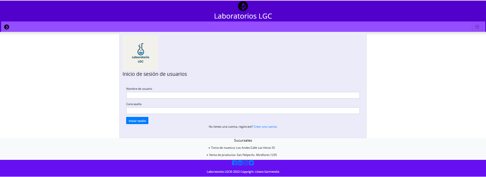
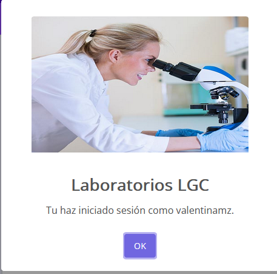
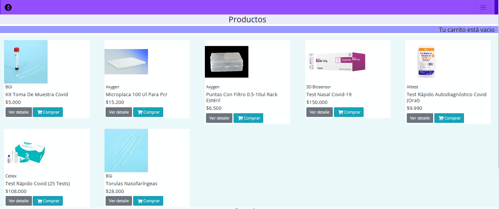
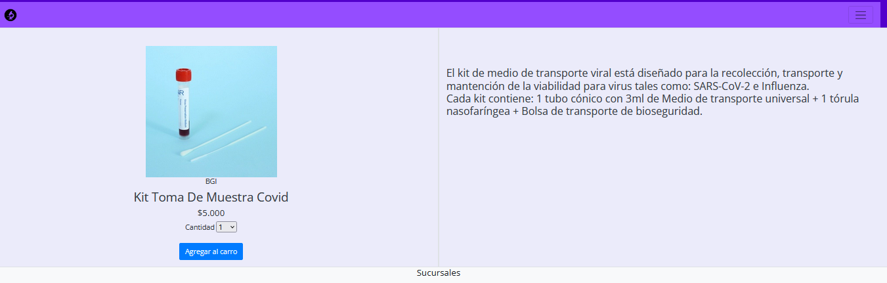
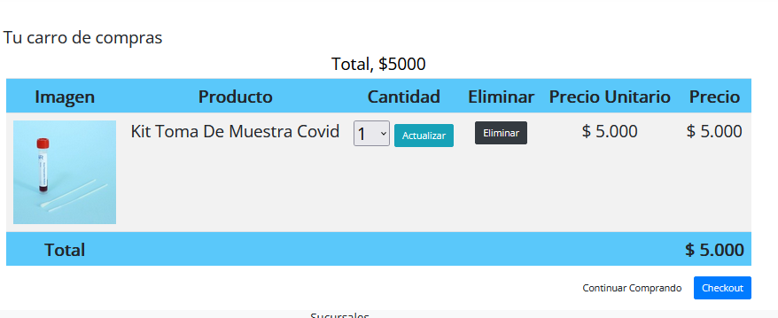
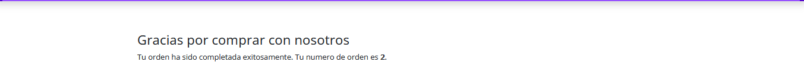
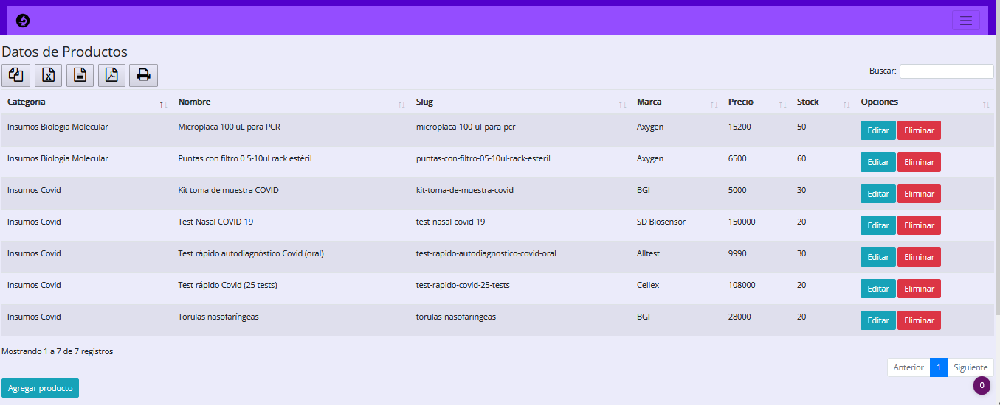

# Sprint M7 individual

**Liliana Garmendia**

Este proyecto consiste en la creación de un sitio web para la venta de  productos de laboratorio y además ofrece servicios. Cuenta con la landing page de presentación del laboratorio, productos, servicios, ubicación y contacto. Por lo que los clientes pueden crear una cuenta, iniciar sesión en el sitio y al acceder pueden comprar productos y revisar los mensajes que ha enviado. Si el usuario es staff le permite administrar el sitio con acceso a listado de clientes, productos, profesionales y los comentarios que han dejado los usuarios con posibilidad de agregar, editar o eliminar éstos.Cada uno cuenta con formulario de registro, edición, eliminación y ver el listado con datatable con botones con las siguientes opciones de para exportar los archivos de las tablas: copiar, excel, csv, pdf o imprimir. Desde el sitio web para acceder a modificar o eliminar éstos necesita ser parte del staff, por lo que en las views se agregó la restricción  @staff_required.

## Instrucciones para instalación

## Instalación

-Clonar el repositorio usando gitbash o el terminal que tenga en su computador local con el siguiente comando:

``` git clone https://github.com/LiliGC/Sprint_individual_M7.git ```
-Abrir la carpeta con el repositorio clonado en un editor de texto como Visual Studio Code con la opción indicada en la imagen.


-Abrir un nuevo terminal en Visual Studio Code y crear el entorno virtual con el siguiente comando:
```pip install venv venv ```

-Luego activar el entorno virtual:

```cd venv/Scripts/activate ```
-Volver a la carpeta principal con cd ..

-Ahora instalar requirements con el siguiente comando:
```pip install -r requirements.txt```

-Hacer las migraciones con el comando:
``` python manage.py migrate```

-Crear tu superusuario para acceder al admin:
```python manage.py createsuperuser```

-Y finalmente levantar el servidor con:
``` python manage.py runserver```

**Observaciones:** Si quisieras cargar los datos que utilicé de prueba tendrías que poner: ```python manage.py loaddata data1.json```  y luego correr el comando ``` python manage.py migrate```
Si tienes problemas para cargar los datos por contenttypes debes usar los siguientes comandos ```python manage.py shell``` para acceder a la shell, luego ingresar los siguientes comandos en orden from ```django.contrib.contenttypes.models import ContentType```,  ```ContentType.objects.all().delete()```, ```quit()```. Y luego volver a correr ```python manage.py loaddata data1.json```.

## Algunas consideraciones

-Se usaron restricciones en el template base en barra de navegación para dar acceso a los clientes a ciertas páginas y al staff a otras.También en las views le usaron las restricciones @login_required y @staff_required. En el admin de django se establecieron grupos para los permisos siendo estos clientes, administadores y profesionales.
-Se puede observar en la siguiente imagen la vista de la barra de navegación con las opciones si no ha iniciado sesión


-Si ha iniciado sesión y es cliente


-Si ha iniciado sesión y es staff


-y la vista para iniciar sesión


-el modal de bienvenida con sweetalert


-el catálogo de productos


-vista detalle de productos


-El carro de compras que se implementó


-El checkout que se realizó la compra


-Lista de productos(staff)


-La tabla anterior también está disponible para clientes y profesionales.

-En la carpeta de static está el diagrama de entidad de la base de datos de labtienda.

## Tecnologías y librerías usadas
Revisar el archivo requirements.txt. Algunas observaciones:
* Se usó la versión más reciente de Django para crear la aplicación.
* Se usó HTML, Bootstrap 5, CSS, JavaScript para crear los templates.
* Para el formulario se usó los que trae django junto con crispy forms para el estilo.
* Para las tablas con el listado de clientes, productos y profesionales se uso DataTable de jquery.
* Para los mensajes de alerta se usó la librería de sweetalert2.
* Se fontawesome para los íconos.
* Se modificó la página del admin importando la librería admin_interface.
* Se usó pillow para la carga de las imágenes de los productos.